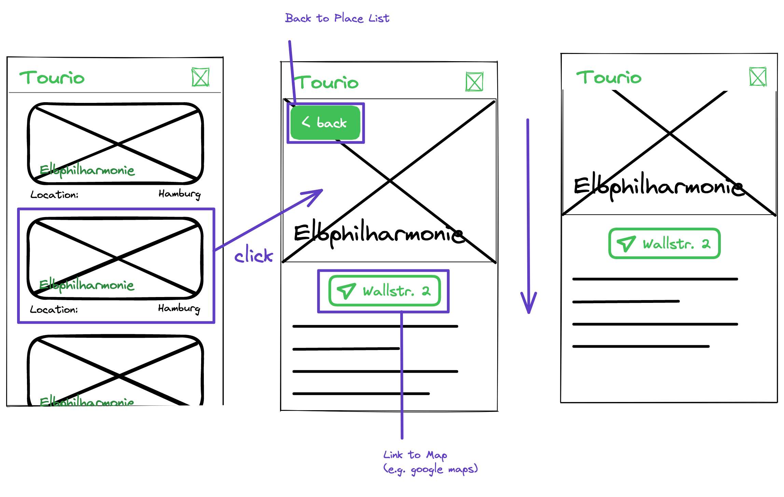

# Recap Project 6 - Tourio

In this project you are going to create a tour attraction app, where you can display, create, update and delete attraction entries in your own mongoDB database. So lets jump right in with the first userstory!

## Userstory 1

### Value Proposition

**As a** User

**I need to** be able to see the database entries

**In order to** to get an overview about all places.

### Description

### Acceptance Criteria

- [ ] All places from the database are displayed as cards
- [ ] In a card, the name of the place is displayed
- [ ] In a card, the image of the place is displayed
- [ ] In a card, the location is displayed
- [ ] The title of the app is always visible in the title bar

### Tasks

- [ ] First use the 3 example places from the dbArray to design the cards
- [ ] Create the title bar
- [ ] Create a card component displaying the required elements
- [ ] Map over the dbArray to create 3 place cards
- [ ] Create an api endpoint in your `api/places` route for fetching all places from the database

## Userstory 2

### Value Proposition

**As a** User

**I need to** be able to create new places

**In order to** expand the places collection.

### Description

### Acceptance Criteria

- [ ] A Link to the create page is displayed as a hovering button on the main page
- [ ] On the create page, a back link to the main page is displayed at the top of the page
- [ ] A name input is displayed
- [ ] An image url input is displayed
- [ ] A location input is displayed
- [ ] A map url input is displayed
- [ ] A description textarea is displayed
- [ ] A submit button is displayed on the bottom of the page
- [ ] When clicking on the submit button, a new place document is created in the database and the user is redirected to the main page

### Tasks

- [ ] Create a Link component for the "add page" and "back" link
- [ ] Create a form component rendering all input fields and the submit button inside a form element, which is expecting a "onSubmit" prop
- [ ] Add the "onSubmit" prop as the callback function for the submit event of the form
- [ ] Add a create folder with an index.js for the create page
- [ ] Create a page component in this file which uses the form component for rendering the input fields
- [ ] Write a handleSubmit function which expects a submit event object
- [ ] Inside this function, send a "post" request to the `api/places` api endpoint with the new place data in the body
- [ ] Expand the api endpoint to handle "post" requests
- [ ] With the received data, create a new place document in the mongoDB
- [ ] In the handleSubmit function, reroute the user to the main page after a successful "post" request

## Userstory 3

### Value Proposition

**As a** User

**I need to**

**In order to**

### Description

### Acceptance Criteria

### Tasks

## Userstory 4

### Value Proposition

**As a** User

**I need to**

**In order to**

### Description

### Acceptance Criteria

### Tasks
